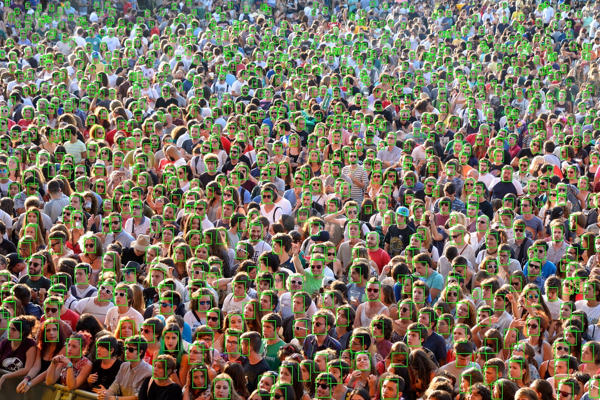

[](https://opensource.org/licenses/MIT)

# Paper survey for facial recognition

## Prerequisites ##
- OS: Ubuntu (tested on 16.04, 18.04, 19.04)
- Python2/3

## Preparations ##
```bash
git clone --recursive https://github.com/xmba15/face_recognition_survey

bash ./sh/preparation.sh

pip install -r requirements --user
# if you are using another version of cuda other than 10.0, try to install the right version of mxnet by fixing the related lines in requirements.txt
```

## How to Use ##

### Feature Extraction ###

```bash
# アラインメントを入れた112x112の顔画像を./images/face_dbに追加してから,
python ./scripts/extract_face_feature.py
# を実行すると、
# 追加した顔画像の特徴ベクトルは./images/face_db.annに保存される。
# 追加した顔画像の名前のリストは./images/face_db.csvで更新される。
```

### Extract Feature From a New Face Image ###

```bash
python ./scripts/extract_face_feature_from_image.py --image_path <image absolute path> --face_name <new name of the new face>
# (paramsは指定されない場合、デフォルトの値は使われます)
```

### Test on Videos ###

```
python ./scripts/video_demo_recognition.py --video_path <video absolute path> --output_path <csv result file absolute output path>
# (paramsは指定されない場合、デフォルトの値は使われます)
```

#### Notes ####

```bash
# csv result format would be
# frame_num, object_1, position, [x1], [x2], [y1], [y2], pose, [yaw], [pitch], [roll], [top1_name], [dist1], [top2_name], [dist2], object_2,...
# Only human objects that are recognized (which means they are detected and their poses and euclidean distances of two features vectors are within range of thresholds) are recorded in result file.
```

### Test Accuracy on Dataset ###

```bash
# a small dataset to test accuracy is provided at images/test.
# Run:
python scripts/test_accuracy.py
# to see the accuracy
```
#### Notes ####

```bash
# A notebook is also provided at scripts/test_accuracy.ipynb to test accuracy step by step
```

### detector_wrapper ####
```bash
This system uses two models of face detector. SFDDetector and MtcnnDetector
SFDDetector is used for detecting face in this system due to its speed and accuracy.
MtcnnDetector is used for getting the face landmarks
```

### Sample images of [SSFD: Single Shot Scale-invariant Face Detector](https://arxiv.org/pdf/1708.05237.pdf) ###
   <p align="center">
    
   </p>

   <p align="center">
    
   </p>
